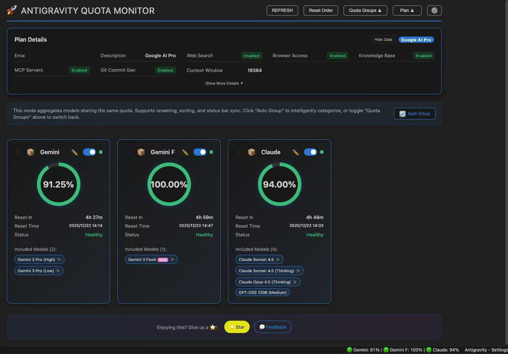
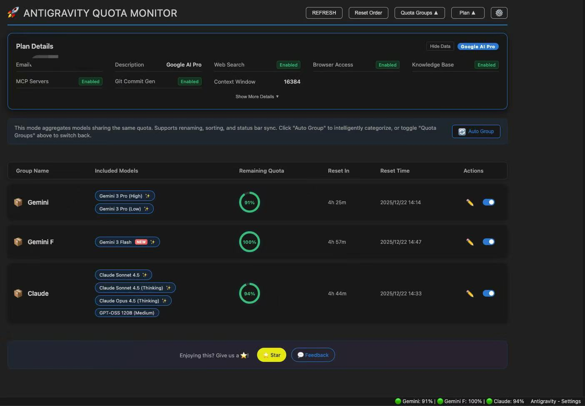
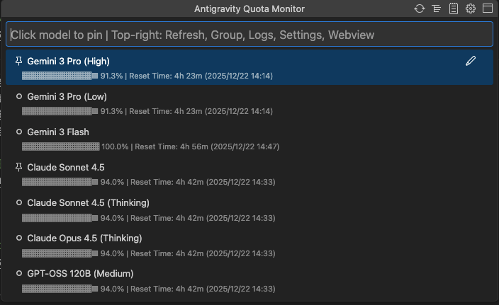
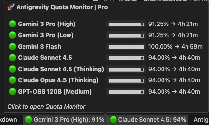
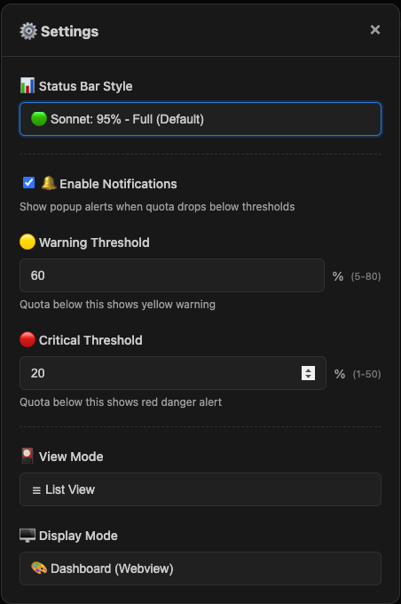

# Antigravity Cockpit

English · [简体中文](README.md)

[](https://open-vsx.org/extension/jlcodes/antigravity-cockpit)
[](https://github.com/jlcodes99/vscode-antigravity-cockpit)
[](https://github.com/jlcodes99/vscode-antigravity-cockpit/issues)
[](https://github.com/jlcodes99/vscode-antigravity-cockpit)

VS Code extension for monitoring Google Antigravity AI model quotas.

**Features**: Webview Dashboard · QuickPick Mode · Quota Grouping · Auto-Grouping · Rename · Card/List View · Drag-and-Drop Sorting · Status Bar Monitor · Threshold Notifications · Privacy Mode

**Languages**: Follows VS Code language setting, supports 14 languages

🇺🇸 English · 🇨🇳 简体中文 · 繁體中文 · 🇯🇵 日本語 · 🇩🇪 Deutsch · 🇪🇸 Español · 🇫🇷 Français · 🇮🇹 Italiano · 🇰🇷 한국어 · 🇧🇷 Português · 🇷🇺 Русский · 🇹🇷 Türkçe · 🇵🇱 Polski · 🇨🇿 Čeština

---

## Features

### Display Modes

Two display modes available, configurable via `agCockpit.displayMode`:

#### Webview Dashboard



- **Card View / List View**: Two layouts, switchable in settings panel
- **Grouping Mode**: Aggregates models by quota pool
- **Non-Grouping Mode**: Shows individual model quotas
- **Drag-and-Drop Sorting**: Reorder cards by dragging
- **Auto-Grouping**: Automatically categorizes models by quota pool



#### QuickPick Mode



Uses VS Code native QuickPick API, suitable for:
- Environments where Webview cannot load
- Users who prefer keyboard navigation
- Quick quota checks

Features:
- Supports grouping / non-grouping mode
- Title bar buttons: Refresh, Toggle Grouping, Logs, Settings, Switch to Webview
- Pin models to status bar
- Rename models and groups

---

### Status Bar

Displays quota status of monitored models. 6 formats available:

| Format | Example |
|--------|---------|
| Icon only | `🚀` |
| Dot only | `🟢` / `🟡` / `🔴` |
| Percent only | `95%` |
| Dot + Percent | `🟢 95%` |
| Name + Percent | `Sonnet: 95%` |
| Full display | `🟢 Sonnet: 95%` |

- **Multi-Model Pinning**: Monitor multiple models simultaneously
- **Auto-Monitor**: Shows the model with lowest remaining quota when no model is pinned

---

### Quota Display

Each model / group shows:
- **Remaining quota percentage**
- **Countdown**: e.g., `4h 40m`
- **Reset time**: e.g., `15:16`
- **Progress bar**: Visual representation of remaining quota

---

### Model Capabilities Tooltip



Hover over model name to view:
- Supported input types (text, image, video, etc.)
- Context window size
- Other capability tags

---

### Grouping Feature

- **Group by Quota Pool**: Models sharing quota pools are grouped automatically or manually
- **Custom Group Names**: Click edit icon to rename
- **Group Sorting**: Drag to reorder groups
- **Group Pinning**: Pin groups to status bar

---

### Settings Panel



Open via gear icon in dashboard header. Configure:
- Status bar display format
- Warning threshold (yellow)
- Critical threshold (red)
- View mode (card / list)
- Notification toggle

---

### Profile Panel

Displays:
- Subscription tier
- User ID
- Collapsible, sensitive data can be masked

---

### Notifications

Sends notifications when model quota falls below warning threshold or is exhausted. Can be disabled in settings.

---

## Usage

1. **Open**:
   - Click status bar icon
   - Or `Ctrl/Cmd+Shift+Q`
   - Or run `Antigravity Cockpit: Open Dashboard` from command palette

2. **Refresh**: Click refresh button or `Ctrl/Cmd+Shift+R` (when dashboard is active)

3. **Troubleshooting**:
   - Click **Retry Connection** when showing "Systems Offline"
   - Click **Open Logs** to view debug logs

---

---

### Auto Wake-up

**NEW** 🔥 Schedule automated requests to wake up AI models and trigger quota reset cycles.

- **Flexible Scheduling**: Supports daily, weekly, interval, and advanced Crontab modes
- **Multi-Model Support**: Wake up multiple models simultaneously
- **Secure**: Credentials encrypted in VS Code Secret Storage, running locally
- **History**: View detailed trigger logs and AI responses
- **Use Case**: Wake up before work to run through the reset cooldown during idle time

---

## Configuration

| Setting | Default | Description |
|---------|---------|-------------|
| `agCockpit.displayMode` | `webview` | Display mode: `webview` / `quickpick` |
| `agCockpit.viewMode` | `card` | View mode: `card` / `list` |
| `agCockpit.refreshInterval` | `120` | Refresh interval (seconds, 10-3600) |
| `agCockpit.statusBarFormat` | `standard` | Status bar format |
| `agCockpit.groupingEnabled` | `true` | Enable grouping mode |
| `agCockpit.warningThreshold` | `30` | Warning threshold (%) |
| `agCockpit.criticalThreshold` | `10` | Critical threshold (%) |
| `agCockpit.notificationEnabled` | `true` | Enable notifications |
| `agCockpit.pinnedModels` | `[]` | Models pinned to status bar |
| `agCockpit.pinnedGroups` | `[]` | Groups pinned to status bar |

---

## Installation

### Open VSX Marketplace
1. `Cmd/Ctrl+Shift+X` to open Extensions panel
2. Search `Antigravity Cockpit`
3. Click Install

### VSIX File
```bash
code --install-extension antigravity-cockpit-x.y.z.vsix
```

---

## Build from Source

```bash
# Clone repository
git clone https://github.com/jlcodes99/vscode-antigravity-cockpit.git
cd vscode-antigravity-cockpit

# Install dependencies
npm install

# Compile
npm run compile

# Package
npm run package
```

Requirements: Node.js v18+, npm v9+

---

## Changelog

- [CHANGELOG.md](CHANGELOG.md) (English)
- [CHANGELOG.zh-CN.md](CHANGELOG.zh-CN.md) (Chinese)

---

## Support

- ⭐ [GitHub Star](https://github.com/jlcodes99/vscode-antigravity-cockpit)
- 💬 [Report Issues](https://github.com/jlcodes99/vscode-antigravity-cockpit/issues)

---

## ☕ Buy Me a Coffee

If you find this extension helpful, consider buying me a coffee! Your support keeps me motivated to continue improving ❤️

[](docs/DONATE.md)

---

## License

[MIT](LICENSE)

---

## Disclaimer

This project is intended for personal learning and research purposes only. By using this project, you agree to:

- Not use this project for any commercial purposes
- Assume all risks and responsibilities associated with using this project
- Comply with relevant service terms and applicable laws

The author is not responsible for any direct or indirect damages arising from the use of this project.
